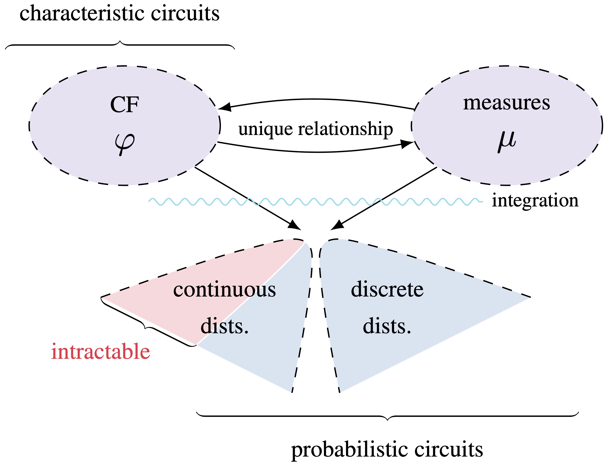

# Characteristic Circuits

This is the official repository for Characteristic Circuits introduced in
[Characteristic Circuits](https://ml-research.github.io/papers/yu2023neurips_cc.pdf) by Zhongjie Yu, Martin Trapp and Kristian Kersting, published at NeurIPS 2023

## Setup

This software runs with julia version 1.8.3, to begin with, run

    pkg> activate .
    pkg> instantiate
    using Conda
    Conda.add("scikit-learn")

in julia to install the packages.
Please refer to [Conda.jl](https://github.com/JuliaPy/Conda.jl) and [PyCall.jl](https://juliapackages.com/p/pycall) if you have issues using Conda and PyCall.

## Demos

To perform parameter and structure learning on MM and BN:

    julia --project=. examples/paramsOptimSyn.jl

To perform structure learning and computing of CFD on MM and BN:

    julia --project=. examples/exp_mm.jl
    julia --project=. examples/exp_bn.jl

To perform structure learning on UCI data sets:

    julia --project=. examples/exp_mixture.jl "breast"
    julia --project=. examples/exp_mixture.jl --leaftype="AlphaStable" "breast"
    julia --project=. examples/exp_mixture.jl --leaftype="AlphaStable" --rdc="rdc" --threshold=0.4 "breast"

To perform parameter learning on UCI data sets with random structure:

    julia --project=. examples/exp_mixture_opt.jl  --iter=100 --lr1=50 --lr2=1 "abalone"

## Citation
If you find this code useful in your research, please consider citing:

    @inproceedings{yu2023neurips_cc,
      title = {Characteristic Circuits},
      author = {Yu, Zhongjie and Trapp, Martin and Kersting, Kristian},
      booktitle = {Proceedings of the 37th Conference on Neural Information Processing Systems (NeurIPS)},
      year = {2023}
    }

## Acknowledgments

* This work was supported by the Federal Ministry of Education and Research (BMBF) Competence Center for AI and Labour ("KompAKI", FKZ 02L19C150). It benefited from the Hessian Ministry of Higher Education, Research, Science and the Arts (HMWK; projects "The Third Wave of AI" and "The Adaptive Mind"), and the Hessian research priority programme LOEWE within the project "WhiteBox". MT acknowledges funding from the Academy of Finland (grant number 347279).

* The code is developed based on the [Julia implementation of SPNs](https://github.com/trappmartin/SumProductNetworks.jl) from Martin Trapp.

